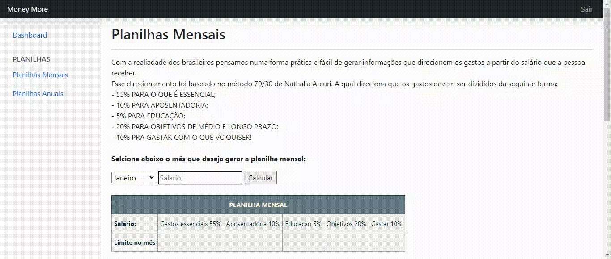
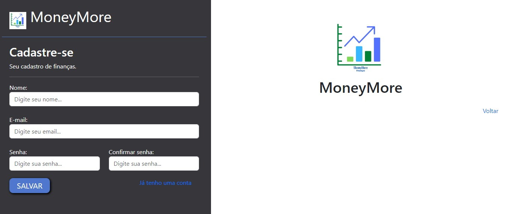
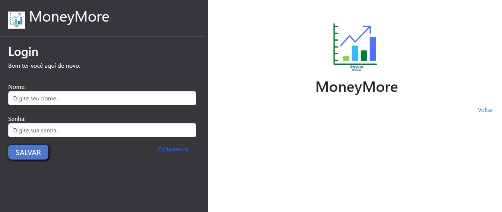
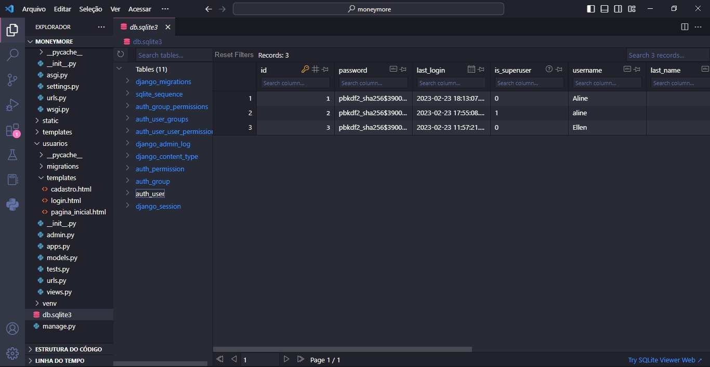

<h1 align="center"> SITE MONEY MORE </h1>

 

---

Projeto desenvolvido com Django junto com Yasmim e Heber

 

  <a href="#-tecnologias">Tecnologias</a>&nbsp;&nbsp;&nbsp;|&nbsp;&nbsp;&nbsp;  
  <a href="#-projeto">Projeto</a>&nbsp;&nbsp;&nbsp;|&nbsp;&nbsp;&nbsp;  
  <a href="#-layouts">Layouts</a>&nbsp;&nbsp;&nbsp;&nbsp;&nbsp;&nbsp;

 

  
Criação do zero de um site para cadastro e adoção de pets.
Foram criados paginas de cadastro, login e paginas para visualização dos pets cadastros por usuarios, dashboard para apresentar a quantidade de pets adotados.

 

## 🚀 Tecnologias

Esse projeto foi desenvolvido com as seguintes tecnologias:

- Python
- Django
- HTML
- CSS
- Javascript
- Git e Github

 

## 💻 Projeto

Projeto integrador feito para conclusão do curso de Programador Web, pelo SENAC em parceria com o Porto Digital.

 

## 📸 Layouts
Layout da tela de cadastro de usuário:

Layout da tela de login:

Layout da tela para cadastrar novo pet:

Layout da tela para pesquisar por um pet, através da raça/cidade:

Layout da tela do Banco de Dados

Layout da tela de Dashboard:

 

